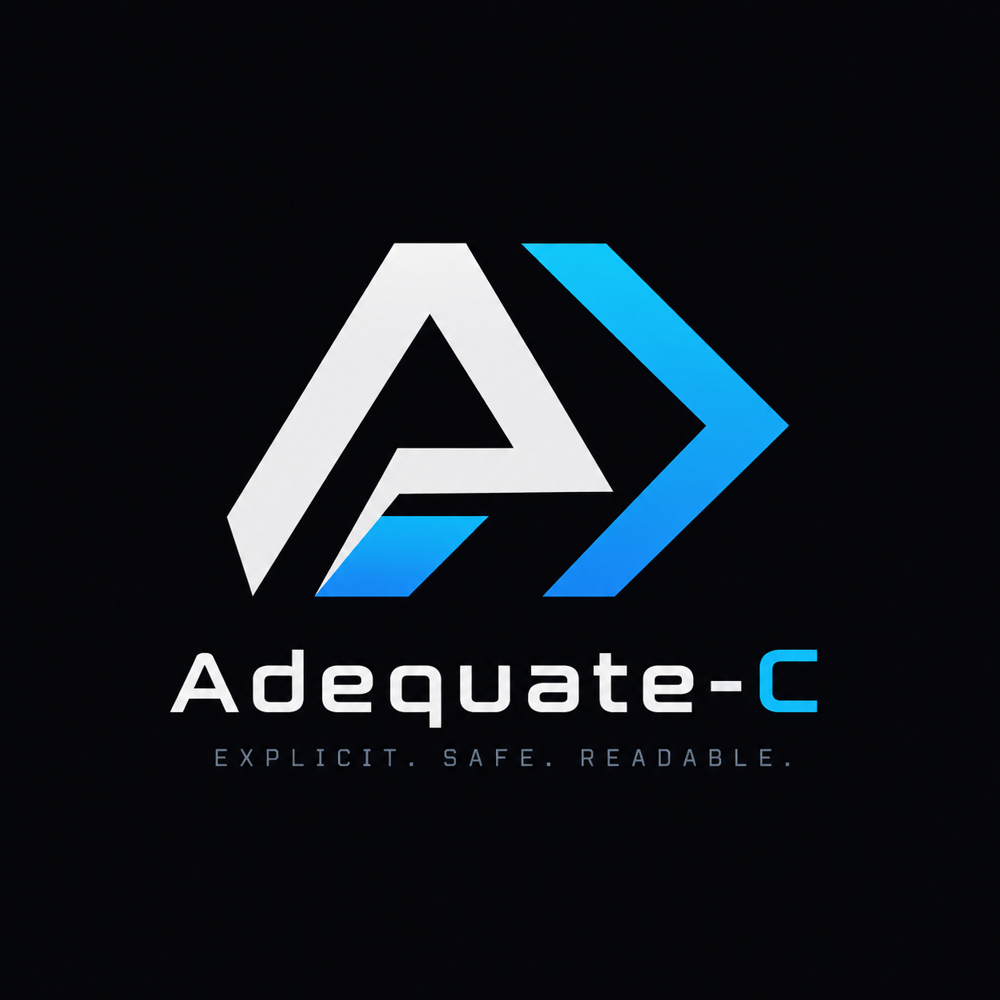

<div align="center">
  
  
  # Adequate-C
  
  **Explicit. Safe. Readable.**
</div>
A statically-typed, general-purpose language inspired by C++, designed to be smaller, safer, and more readable. Adequate-C's core design goal is explicitness: every keyword, type, and construct should be immediately understandable without knowing the language's history. Adequate-C targets systems-familiar developers who want a fast, ergonomic, and compact language, as well as programmers coming from higher-level languages who want a gentler introduction to systems programming. The language is currently in early development.

## Building

#### Build
```bash
make build
```

#### Build and Run
```bash
make run
```

#### Other Commands
```bash
make clean   # Remove build dir
make format  # Format source code
make help    # Show all commands
```

#### Manual Build (without Makefile)
```bash
mkdir build && cd build
cmake ..
make
./adequatec
```

## Requirements
- C++23 compatible compiler (GCC 14+ / Clang 17+)
- CMake 3.13+
- clang-format (for code formatting)
